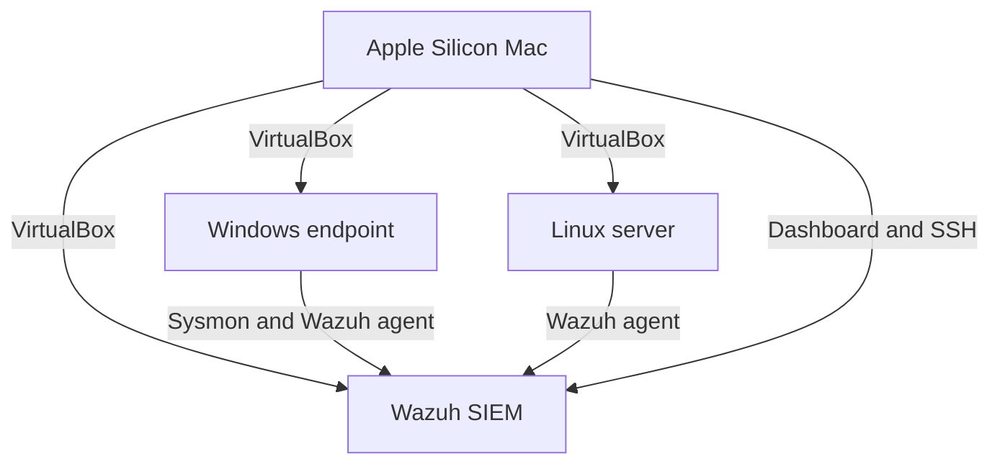

# Security Home Lab — Detection Engineering

> **Project status:** Repository implementation complete; live lab deployment and evidence collection in progress

## Project summary

This repository documents a three-system security home lab designed to simulate and detect common attack techniques. The environment consists of a Windows endpoint, a Linux server, and a Wazuh SIEM system running through VirtualBox on an Apple Silicon Mac.

The project uses **Python, Sysmon, Wazuh, VirtualBox, Windows, and Linux**. It includes endpoint-monitoring configurations, three custom detection rules mapped to MITRE ATT&CK, a tested Python Sysmon-log parser, and a NIST Cybersecurity Framework gap assessment.

For the complete project narrative, implementation decisions, findings, and validation plan, see the [final project report](docs/final-project-report.md).

## Lab architecture

| System | Role |
|---|---|
| Windows endpoint | Generates Sysmon endpoint telemetry and controlled test events |
| Linux server | Provides Linux administration and security-monitoring practice |
| Wazuh SIEM | Collects, analyzes, and displays endpoint events |



## Resume deliverables

### Three-system virtual lab

The documented design contains a Windows endpoint, Linux server, and Wazuh SIEM. The Ubuntu Server ARM64 VM has been created, updated, and administered through SSH. The Windows and Wazuh deployment procedures are prepared for the next lab phase.

### Sysmon and Wazuh monitoring

- `configs/sysmonconfig.xml` contains the Sysmon telemetry configuration.
- `configs/wazuh-agent-sysmon.xml` contains the Wazuh Windows event-channel collection block.
- `docs/test-plan.md` defines how event delivery and alerting will be validated.

### Three custom detection rules

`detections/local_rules.xml` contains three rules mapped to MITRE ATT&CK:

| Rule ID | Detection | MITRE ATT&CK |
|---|---|---|
| 100100 | Encoded PowerShell execution | T1059.001 |
| 100101 | Certutil with download-related arguments | T1105 |
| 100102 | Rundll32 execution | T1218.011 |

These rules are ready for testing with live Wazuh events and `wazuh-logtest`.

### Python Sysmon-log parser

`scripts/sysmon_parser.py` reads Sysmon-style or Wazuh JSONL events and normalizes important fields into JSON or CSV. The parser has automated tests and synthetic sample data.

```bash
python3 scripts/sysmon_parser.py samples/sysmon_events.jsonl
python3 scripts/sysmon_parser.py samples/sysmon_events.jsonl --format csv --output normalized.csv
python3 -m unittest discover -s tests -v
```

### NIST CSF gap assessment

`docs/nist-csf-gap-analysis.md` evaluates the home lab across the NIST CSF functions. It includes control status, findings, risk ratings, evidence requirements, and prioritized remediation recommendations.

## Current validation status

| Item | Status |
|---|---|
| Ubuntu Server VM | Completed |
| SSH administration | Completed |
| Python parser | Implemented and tested |
| Synthetic parser sample | Completed |
| Three MITRE mapped rules | Written; live validation pending |
| Sysmon and Wazuh configurations | Written; deployment pending |
| Windows endpoint | Deployment pending |
| Wazuh SIEM | Deployment pending |
| NIST CSF assessment | Initial assessment completed; evidence updates pending |

## Project documentation

- [Final project report](docs/final-project-report.md)
- [Architecture](docs/architecture.md)
- [Setup notes](docs/setup-notes.md)
- [Detection catalog](docs/detection-catalog.md)
- [Detection test plan](docs/test-plan.md)
- [NIST CSF gap analysis](docs/nist-csf-gap-analysis.md)
- [Incident-response playbook](docs/incident-response-playbook.md)
- [Troubleshooting notes](docs/troubleshooting.md)

## Repository structure

```text
configs/       Sysmon and Wazuh configuration files
detections/    Three custom MITRE ATT&CK-mapped rules
docs/          Architecture, testing, findings, and NIST assessment
samples/       Synthetic sanitized Sysmon events
screenshots/   Sanitized implementation evidence
scripts/       Python Sysmon-log parser
tests/         Automated parser tests
```

## Security and evidence policy

The repository excludes passwords, enrollment secrets, private keys, personal information, full virtual-machine disks, and unsanitized logs. Live results are marked validated only after they are reproduced in the lab and supported by evidence.
