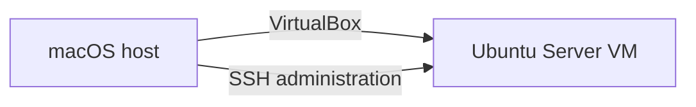
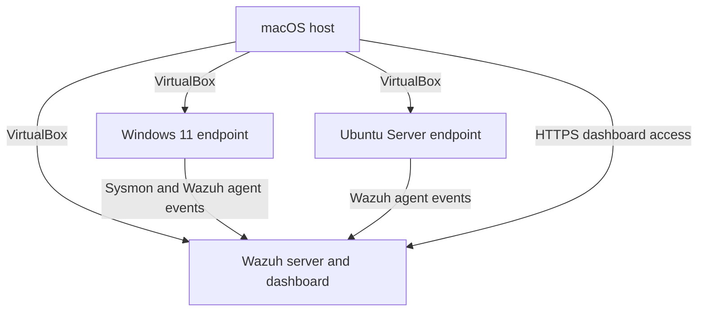

# Lab Architecture

## Current state

The current environment consists of the macOS host and one Ubuntu Server virtual machine. The VM is reachable through SSH and can be administered from Terminal.

## Target state

## Component responsibilities

| Component | Responsibility |
|---|---|
| macOS host | Runs VirtualBox, administers the lab, and accesses the dashboard |
| Windows endpoint | Produces Sysmon telemetry and controlled test events |
| Ubuntu Server endpoint | Provides Linux telemetry and remote-administration practice |
| Wazuh server | Collects, indexes, analyzes, and displays security events |

## Resource strategy

The host has 16 GB of memory. Wazuh and the endpoint VM needed for a test will run together, while unused VMs can remain powered off. This keeps the lab usable without requiring every machine to run simultaneously.

## Network design

The initial Linux setup uses VirtualBox NAT. The final network configuration will be documented after communication among the Wazuh server and endpoints is tested. The final design must allow agent-to-server traffic while limiting unnecessary exposure to the local network.
