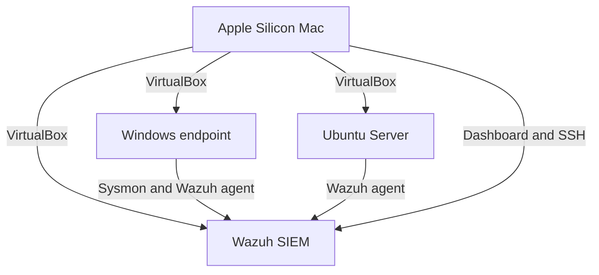

# Security Home Lab — Detection Engineering Project Report

## Executive summary

This project develops a three-system cybersecurity home lab for endpoint telemetry collection, centralized monitoring, detection engineering, and alert investigation. The environment is designed around a Windows endpoint, an Ubuntu Server system, and a Wazuh SIEM deployment hosted with VirtualBox on an Apple Silicon Mac.

The repository contains the technical artifacts required for the environment: Sysmon and Wazuh configuration files, three custom Wazuh detection rules mapped to MITRE ATT&CK, a Python utility for normalizing Sysmon-style JSONL events, automated parser tests, a detection-validation plan, an incident-response playbook, and a NIST Cybersecurity Framework 2.0 gap assessment.

The repository implementation and Python test suite are complete. Deployment-specific results in this report are intentionally marked pending until they are reproduced in the live lab and supported by sanitized evidence.

## Project objectives

The project was created to demonstrate the ability to:

1. Build and administer a virtualized Windows and Linux security environment.
2. Configure Sysmon to collect useful Windows endpoint telemetry.
3. Forward endpoint events to Wazuh for centralized monitoring.
4. Write and document custom detection rules.
5. Map detections to MITRE ATT&CK techniques.
6. Use Python to normalize security-event data.
7. Validate detection logic with repeatable positive and negative tests.
8. Assess operational gaps using the NIST Cybersecurity Framework.

## Environment and architecture

| Component | Purpose |
|---|---|
| Apple Silicon Mac | Hosts VirtualBox, administers the lab, and accesses the Wazuh dashboard |
| Ubuntu Server | Provides Linux administration, SSH, and endpoint-monitoring practice |
| Windows endpoint | Generates Sysmon process telemetry and controlled test events |
| Wazuh SIEM | Collects, analyzes, and displays endpoint events and custom alerts |

The host has 16 GB of memory, so the lab uses a staged resource strategy: Wazuh and the endpoint required for the active test run together while unused virtual machines remain powered off.

## Implementation

### Linux server foundation

An Ubuntu Server ARM64 virtual machine was created in VirtualBox with 2 GB of memory, two virtual processors, and a 30 GB virtual disk. OpenSSH was installed and enabled, remote administration from macOS Terminal was confirmed, installed packages were updated, and the server was shut down cleanly through SSH.

### Windows telemetry configuration

`configs/sysmonconfig.xml` defines the Sysmon telemetry used by the lab. The configuration focuses on process-creation events needed to observe command lines, executable images, users, parent processes, hashes, and process identifiers.

`configs/wazuh-agent-sysmon.xml` defines the Windows event-channel collection block used to forward events from `Microsoft-Windows-Sysmon/Operational` to Wazuh.

### Custom detection engineering

Three custom rules are defined in `detections/local_rules.xml`:

| Rule ID | Detection logic | MITRE ATT&CK | Intended signal |
|---|---|---|---|
| 100100 | PowerShell launched with encoded-command arguments | T1059.001 | Potential obfuscated PowerShell execution |
| 100101 | Certutil used with download-related arguments | T1105 | Potential tool transfer using a native utility |
| 100102 | Rundll32 process execution | T1218.011 | Potential proxy execution through a signed binary |

These rules are designed for controlled lab validation. A match is an investigation signal, not proof of malicious activity. Command context, parent process, user, and surrounding events must be reviewed before classification.

### Python event-processing utility

`scripts/sysmon_parser.py` reads Sysmon-style or Wazuh JSONL data, extracts important event fields, and writes normalized JSON or CSV output. The parser supports repeatable analysis outside the SIEM and provides a small software-engineering component within the security project.

The automated test suite checks three behaviors:

- normalization of a valid Sysmon process-creation event;
- handling of a nested Wazuh event structure; and
- omission of malformed or unsupported input without stopping the entire run.

GitHub Actions runs the tests automatically when relevant parser, test, or workflow files change. The current workflow completes successfully.

## Validation strategy

Validation uses controlled activity only on systems owned and administered by the project author. Each detection receives both a positive test that should alert and a benign negative test that should not alert.

| Test | Expected result | Current evidence state |
|---|---|---|
| Python unit tests | All parser tests pass | Completed |
| Ubuntu SSH administration | Remote login and commands succeed | Completed; sanitized screenshot pending |
| Windows agent enrollment | Endpoint appears active in Wazuh | Pending live deployment |
| Sysmon ingestion | Event ID 1 is searchable in Wazuh | Pending live deployment |
| Rule 100100 | Encoded PowerShell test matches the intended rule | Pending live validation |
| Rule 100101 | Controlled certutil test matches the intended rule | Pending live validation |
| Rule 100102 | Controlled rundll32 test matches the intended rule | Pending live validation |
| Negative tests | Benign controls do not match custom rules | Pending live validation |

Detailed procedures and evidence requirements are maintained in `docs/test-plan.md`.

## Findings and security assessment

The NIST CSF 2.0 assessment identified six project-level findings across Identify, Protect, Detect, Respond, and Recover:

| ID | Finding | Risk | Planned treatment |
|---|---|---|---|
| F-01 | Asset inventory lacks final versions, addresses, and ownership data | Low | Record the completed inventory and deployment dates |
| F-02 | SSH hardening requires documented review | Medium | Review authentication, root login, and firewall settings |
| F-03 | Central Wazuh collection requires end-to-end validation | High | Enroll endpoints and confirm known events |
| F-04 | Custom rules require live testing and tuning | High | Run positive/negative tests and record tuning decisions |
| F-05 | Alert-triage workflow has not yet been exercised | Medium | Complete one documented alert investigation |
| F-06 | Snapshot and recovery procedures require testing | Medium | Perform and document a harmless restore test |

The findings are not presented as vulnerabilities in a production organization. They are gaps between the lab's current evidence and its intended final operating state. The detailed conditions, impacts, evidence, and recommendations are documented in `docs/nist-csf-gap-analysis.md`.

## Alert-triage approach

When a custom alert is generated, the investigation records the Wazuh rule, alert level, MITRE technique, endpoint, timestamp, process image, command line, parent process, and user. Related activity is scoped using the process GUID and surrounding timestamps. The event is then classified as expected test activity, benign activity, a false positive, or unexplained activity. Any rule-tuning decision is documented with the supporting evidence.

## Security and evidence handling

The public repository excludes passwords, enrollment secrets, private keys, personal information, virtual-machine disks, and unsanitized logs. Screenshots and exported events are reviewed before publication, and live outcomes are labeled validated only after they have been reproduced.

## Limitations

- The lab is a resource-constrained educational environment, not a production security operations center.
- The custom rules cover three selected process-execution behaviors and are not comprehensive threat coverage.
- MITRE ATT&CK mappings describe the behavior detected; they do not establish malicious intent by themselves.
- Synthetic sample events validate parser behavior but do not replace live telemetry validation.
- Final performance, false-positive, response, and recovery observations depend on completion of the live environment.

## Final outcome

The project demonstrates virtualization, Linux server administration, SSH, endpoint-monitoring design, detection-rule development, MITRE ATT&CK mapping, Python log processing, automated testing, incident-response planning, and framework-based security assessment. The completed repository provides a reproducible technical foundation and a clear evidence plan. Live Wazuh deployment, Windows enrollment, rule validation, and screenshot collection are the remaining steps required to close the documented findings and mark the lab fully validated.

## Evidence to insert after live validation

- Wazuh dashboard and installed version
- Active Windows and Linux agents
- Sysmon Event ID 1 visible in Wazuh
- Successful `wazuh-logtest` output for rules 100100–100102
- One custom alert in the Wazuh dashboard
- One completed alert-triage record
- Snapshot or recovery-test result
- Final sanitized parser output from a live event
